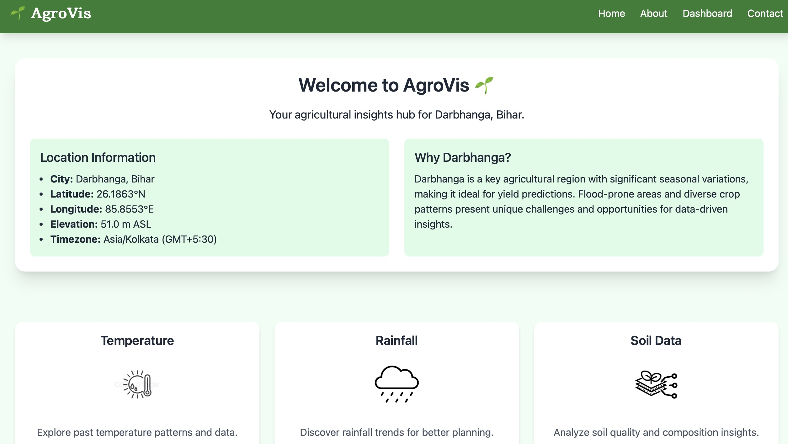

# AgroVis 🌱

AgroVis is an ongoing project aimed at predicting crop yield based on various environmental factors such as rainfall, temperature, soil data, and historical agricultural patterns. By leveraging machine learning techniques and data analysis, AgroVis seeks to provide farmers and agricultural analysts with insights to optimize crop production and mitigate risks.

## Project Status
This project is currently under development. Features and functionalities are being actively implemented and refined.

## Features (Planned and Ongoing)
- Data collection and preprocessing from historical agricultural records.
- Machine learning models for yield prediction.
- Data visualization tools for trend analysis.
- Web-based interface for user interaction (future scope).

## Technologies Used
- **Backend:** Django (Python)
- **Data Processing & Analysis:** NumPy, pandas, Matplotlib, Seaborn
- **Database:** PostreSQL

## Dashboard

## License
This project is under development, and licensing details will be finalized upon completion.

