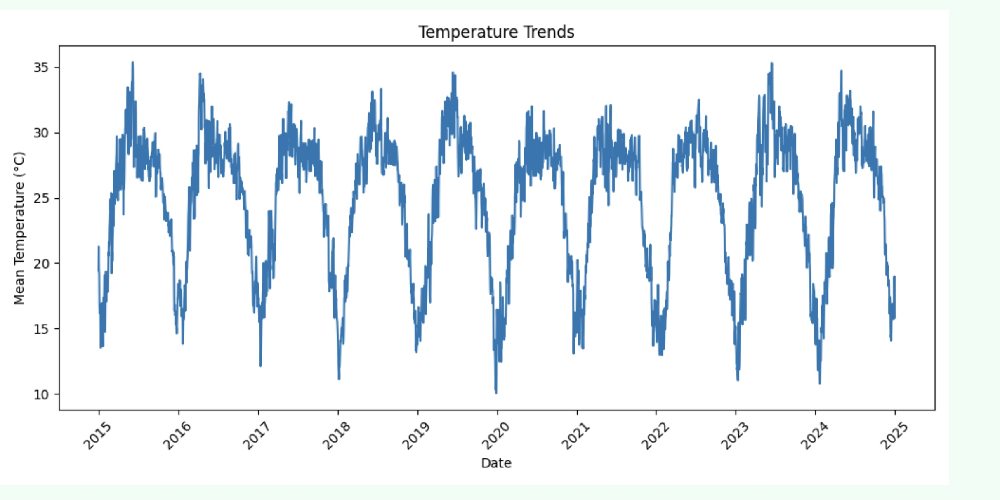

# AgroVis 🌱

AgroVis is an ongoing project aimed at predicting crop yield based on various environmental factors such as rainfall, temperature, soil data, and historical agricultural patterns. By leveraging machine learning techniques and data analysis, AgroVis seeks to provide farmers and agricultural analysts with insights to optimize crop production and mitigate risks.

## 📄 Project Status
This project is currently under development. Features and functionalities are being actively implemented and refined.

## 📊 Dashboard

## 🚀 Key Features  
- **Data Processing:** Processed 10 years of historical weather, soil, and crop yield data, analyzing over 100,000 records to identify key factors influencing yield.  
- **API Integration:** Integrated ‘Open-Meteo’ API to retrieve real-time and historical weather data, including rainfall, temperature, and humidity, reducing API calls by 60% through efficient caching and data storage.  
- **Database Management:** Utilized PostgreSQL to store historical data locally, minimizing redundant API requests and reducing data retrieval time by 40%.  
- **Data Visualization:** Developed interactive charts to illustrate yield trends, rainfall distribution, and temperature variations across different seasons. 
- **Predictive Analytics:** Implementing a Random Forest model and other ML models to predict crop yields based on past weather and soil data trends.  

## 🛠️ Tech Stack  
**Backend:** Python, Django, RESTful APIs, Open-Meteo API  
**Data Processing & Analysis:** NumPy, pandas, Matplotlib, Seaborn, scikit-learn  
**Frontend:** JavaScript  
**Database:** PostgreSQL

## 📜 License
This project is licensed under the MIT License.

